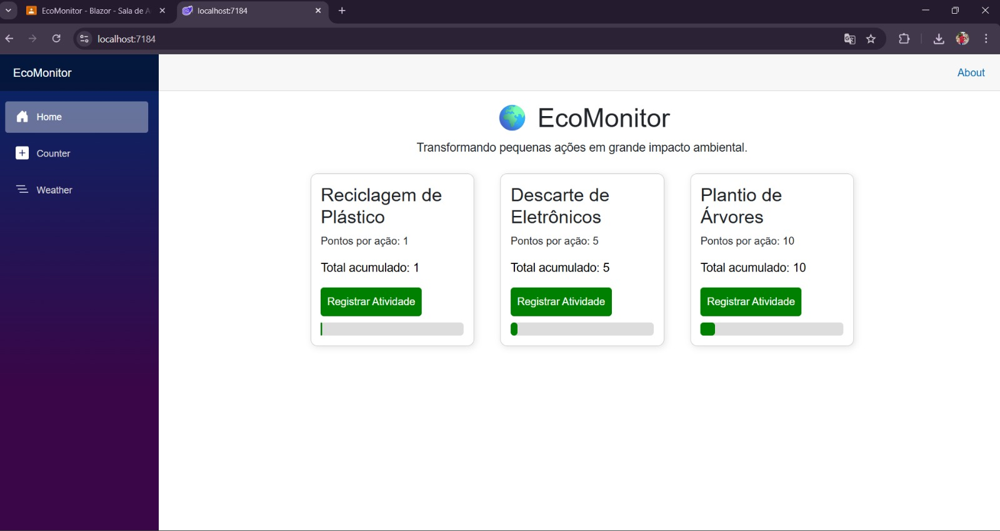

# 🌍 EcoMonitor 

##  Identificação
Nome: christian da silva rodrigues  
Curso: análise e desenvolvimento de sistemas  

---

##  Heurísticas de Nielsen

1. Visibilidade do status do sistema  
→ O contador mostra o valor atualizado em tempo real  

2. Feedback do usuário  
→ O botão altera imediatamente o valor  

---

##  Como executar
usando o seguinte comando:

dotnet run --launch-profile https

## Screenshot da Aplicação

## Explicação Técnica

O componente EcoStatus foi criado para ser reutilizável dentro da aplicação. Para isso foram utilizados parâmetros com Parameter, 
que permitem receber valores como título e peso diretamente do componente principal Home.razor.

O valor da pontuação é armazenado na variável Total, que representa o estado do componente.
Sempre que o usuário clica no botão o método Somar é executado, aumentando o valor do total com base no peso definido.

Esse funcionamento demonstra o uso básico do Blazor, com passagem de parâmetros, manipulação de estado e interação com o usuário através de eventos.
